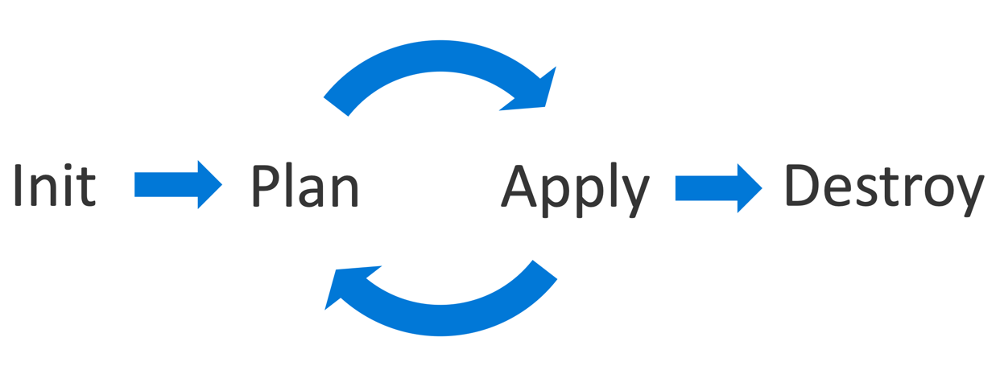

# Terraform para iniciantes.
 


Terraform é uma ferramenta para construir, alterar e configurar infraestrutura.
Isso pode ser feito tanto localmente quanto remoto.


_ Falando em remoto, alguns exemplos de nuvens públicas que podemos trabalhar utilizando o terraform, [clique aqui](https://registry.terraform.io/browse/providers)_

Neste post vamos utilizar AWS por causa do [free tier](https://aws.amazon.com/pt/free/?all-free-tier.sort-by=item.additionalFields.SortRank&all-free-tier.sort-order=asc&awsf.Free%20Tier%20Types=*all&awsf.Free%20Tier%20Categories=*all)

Para nos comunicarmos com a aws, vamos precisar de duas chaves _aws_access_key_ e _aws_secret_key_, essas chaves podem ser configuradas via [aws-cli](https://docs.aws.amazon.com/pt_br/cli/latest/userguide/install-cliv2.html)
você precisa configura-las na sua máquina.


### Mãos a obra.

Recomendo você criar uma pasta, após isso dentro dessa pasta crie os seguintes arquivos:

```
main.tf
ec2.tf
output.tf
script.sh
security-group.tf
vars.tf

```


#### No arquivo main.tf, iremos incluir o nosso provider aws.
#### Estamos declarando também aonde a nossa infraestrutura será provisionada _us-east-1_.
#### Para saber mais sobre Regiões e zonas de disponibilidade [clique aqui](https://aws.amazon.com/pt/about-aws/global-infrastructure/regions_az/

```
provider "aws" {
  region = "us-east-1"
}
```


#### No arquivo ec2.tf, vamos declarar a nossa instancia (instance_type) a t2.micro esta dentro do [free tier](https://aws.amazon.com/pt/free/?all-free-tier.sort-by=item.additionalFields.SortRank&all-free-tier.sort-order=asc&awsf.Free%20Tier%20Types=*all&awsf.Free%20Tier%20Categories=*all), estamos citando o script.sh que irá instalar o nginx.
#### Aqui também citamos o security group e que vai se comportar como um firewall para a nossa instancia liberando apenas as portas necessárias.


```
resource "aws_instance" "web1" {
  ami           = var.amis["us-east-1"]
  instance_type = "t2.micro"
  user_data     = file("script.sh")
  tags = {
    Name = "web1"
  }

  vpc_security_group_ids = [aws_security_group.web1.id]
}
```

#### O output.tf utilizamos para que no final da execução do nosso código nos seja apresentado alguma informação desejada.
#### No caso aqui será uma url para acessarmos a instancia via browser.

```
output "dns" {
  value = aws_instance.web1.public_dns
}
```

#### Através do security-group.tf declaramos as portas que estaram abertas de entrada e saida.
#### Também podemos limitar esses acessos via ip.
#### Estamos utilizando variável para facilitarmos o nosso dia, caso precise alterar o ip de acesso, alteramos em apenas um lugar.

```
resource "aws_security_group" "web1" {
  name        = "web1"
  description = "Allow web"

  ingress {
    description = "ssh"
    from_port   = 22
    to_port     = 22
    protocol    = "tcp"
    cidr_blocks = var.cdirs_acesso_remoto
  }
  ingress {
    from_port   = 80
    protocol    = "TCP"
    to_port     = 80
    cidr_blocks = var.cdirs_acesso_remoto
  }
  ingress {
    from_port   = 443
    protocol    = "TCP"
    to_port     = 443
    cidr_blocks = var.cdirs_acesso_remoto
  }

  egress {
    from_port   = 0
    to_port     = 0
    protocol    = "-1"
    cidr_blocks = ["0.0.0.0/0"]
  }

  tags = {
    Name = "web1"
  }
}
```

#### As variáveis citadas acima, serão declaras no arquivo vars.tf.
#### Não esqueça de incluir o seu ip para poder acessar.

```
variable "amis" {
  type = map(string)

  default = {
    "us-east-1" = "ami-09e67e426f25ce0d7"
    "us-east-2" = "ami-09e67e426f25ce0d7"
  }
}

variable "cdirs_acesso_remoto" {
  type    = list(string)
  default = ["seu-ip/32"]
}
```

**Um poucos sobre os comandos que serão executados:**




_[## terraform init](https://www.terraform.io/docs/cli/commands/init.html)_
Este comando irá realizar diversas tarefas dentro do nosso diretório, umas delas é baixar as informacoes necessárias para nos comunicarmos com a AWS.
Ex:
```
 terraform init

Initializing the backend...

Initializing provider plugins...
- Finding latest version of hashicorp/aws...
- Installing hashicorp/aws v3.51.0...
- Installed hashicorp/aws v3.51.0 (self-signed, key ID 34365D9473R7968F)
```


_[## terraform plan](https://www.terraform.io/docs/cli/commands/plan.html)_
Criamos um plano de execucao, podemos ver o que o terraform irá criar.
No final do plano apresentado será exibido a seguinte informacao.
```
Plan: 2 to add, 0 to change, 0 to destroy.

Changes to Outputs:
  + dns = (known after apply)
```

_[## terraform apply](https://www.terraform.io/docs/cli/commands/apply.html)_
Executamos o plano proposto no terraform apply, digite _yes_ quando for solicitado a confirmacao.

```
  Enter a value: yes

aws_security_group.webapp: Creating...
aws_security_group.webapp: Creation complete after 7s [id=sg-0fc316f1d61457e9f]
aws_instance.web1: Creating...
aws_instance.web1: Still creating... [10s elapsed]
aws_instance.web1: Still creating... [20s elapsed]
aws_instance.web1: Still creating... [30s elapsed]
aws_instance.web1: Creation complete after 40s [id=i-02874a95a1761f277]
Apply complete! Resources: 2 added, 0 changed, 0 destroyed.
```

Após a execucao, receberemos o que foi proposto no arquivo output.tf.

```
Outputs:

dns = "ec2-3-215-73-133.compute-1.amazonaws.com"
```

Para testar, basta executar o comando:

```
curl http://ec2-3-215-73-133.compute-1.amazonaws.com
<h1>Hello World from the other side, i am at ip-172-31-8-224.ec2.internal</h1>
```
Caso queira, podem logar no console da AWS e verificar o que foi provisionado

## Nossa EC2.


## Nosso grupo de seguranca.


_[## terraform destroy](https://www.terraform.io/docs/cli/commands/destroy.html)_
Como o nome já diz, destruimos o que foi provisionado.
O terraform irá lhe informar o que será destriudo e você precisa confirmar:

```
 Enter a value: yes

aws_instance.web1: Destroying... [id=i-02874a95a1761f277]
aws_instance.web1: Still destroying... [id=i-02874a95a1761f277, 10s elapsed]
aws_instance.web1: Still destroying... [id=i-02874a95a1761f277, 20s elapsed]
aws_instance.web1: Still destroying... [id=i-02874a95a1761f277, 30s elapsed]
aws_instance.web1: Destruction complete after 33s
aws_security_group.webapp: Destroying... [id=sg-0fc316f1d61457e9f]
aws_security_group.webapp: Destruction complete after 2s

Destroy complete! Resources: 2 destroyed.
```


